# Визуализация курсовой работы по ОТС

## Цель проекта

Собрать интерактивную HTML/CSS/JS-визуализацию курсовой работы
«Система передачи аналоговой информации с АЦП».

Пользователь должен последовательно пройти по структурной схеме системы
передачи информации: от аналогового сообщения источника до восстановленного
сообщения у получателя. На каждом этапе интерфейс показывает:

- назначение текущего блока;
- входной и выходной сигналы;
- формулы из методических указаний;
- подстановку значений выбранного варианта;
- графики или схемы, поясняющие преобразование;
- результат расчёта и его физический смысл.

Основные исходные материалы:

- `docs/coursework_methodical_instructions.docx` — методические указания;
- `docs/structure_scheme.png` — структурная схема, по которой строится интерфейс;

## Что описывает исходная схема

На изображении показана смешанная аналого-цифровая система передачи
информации с импульсно-кодовой модуляцией (ИКМ).

Сообщение сначала преобразуется в электрический аналоговый сигнал,
ограничивается по спектру, дискретизируется, квантуется и кодируется.
Полученная последовательность битов управляет модулятором. Модулированный
сигнал передаётся по линии связи, где к нему добавляется помеха.

На приёмной стороне выполняется обратная цепочка: детектирование,
декодирование, интерполяция, фильтрация и преобразование электрического
сигнала в сообщение для получателя.

## Реконструкция `structure_scheme.png`

Для удобства чтения Mermaid-схема развёрнута в один логический маршрут слева
направо. На исходном PNG передающая часть расположена сверху, а приёмная
ветка возвращается справа налево по нижней части изображения.

```mermaid
flowchart LR
    source(["Источник<br/>сообщений"])
    primary["Первичный<br/>преобразователь"]
    tx_lpf["ФНЧ"]

    subgraph adc["АЦП"]
        direction LR
        sampler["Дискретизатор"]
        quantizer["Квантователь"]
        encoder["Кодер"]
        delta["Генератор<br/>δ(t)"]

        delta --> sampler
        sampler -->|"x(k · Δt)"| quantizer
        quantizer -->|"vₖʲ"| encoder
    end

    carrier["Генератор<br/>несущей"]
    modulator["Модулятор"]
    tx_output["Выходное устройство<br/>ПДУ"]

    subgraph channel["НКС: непрерывный канал связи"]
        direction TB
        noise["Источник<br/>помех"]
        line["Линия<br/>связи"]
        noise -->|"n(t)"| line
    end

    rx_input["Входное устройство<br/>ПРУ"]
    detector["Детектор<br/>(РУ)"]

    subgraph dac["ЦАП"]
        direction RL
        decoder["Декодер"]
        interpolator["Интерполятор"]
        decoder -->|"v̂ₖʲ"| interpolator
    end

    rx_lpf["ФНЧ"]
    output["Выходной<br/>преобразователь"]
    recipient(["Получатель"])

    source -->|"c(t)"| primary
    primary -->|"g(t)"| tx_lpf
    tx_lpf -->|"x(t)"| sampler
    encoder -->|"bₖᵘ"| modulator
    carrier -->|"uₙ(t)"| modulator
    modulator -->|"s(t, bₖᵘ)"| tx_output
    tx_output -->|"S(t)"| line
    line -->|"z(t) = χS(t) + n(t)"| rx_input
    rx_input -->|"ŝ(t, bₖᵘ)"| detector
    detector -->|"b̂ₖᵘ"| decoder
    interpolator -->|"x̂(t)"| rx_lpf
    rx_lpf -->|"ĝ(t)"| output
    output -->|"ĉ(t)"| recipient

    classDef sourceNode fill:#e6f7ff,stroke:#0b79a8,stroke-width:2px;
    classDef txNode fill:#fff3d6,stroke:#b7791f,stroke-width:2px;
    classDef rxNode fill:#f5e8ff,stroke:#805ad5,stroke-width:2px;
    classDef channelNode fill:#e8f7ef,stroke:#238636,stroke-width:2px;

    class source,primary sourceNode;
    class tx_lpf,sampler,quantizer,encoder,delta,carrier,modulator,tx_output txNode;
    class line,noise channelNode;
    class rx_input,detector,decoder,interpolator,rx_lpf,output,recipient rxNode;
```



### Сигналы в сечениях схемы

| Обозначение | Где находится | Смысл |
| --- | --- | --- |
| `c(t)` | источник сообщений | исходное аналоговое сообщение |
| `g(t)` | первичный преобразователь | электрический сигнал сообщения |
| `x(t)` | передающий ФНЧ | сигнал с ограниченным спектром |
| `x(k · Δt)` | дискретизатор | отсчёты аналогового сигнала |
| `vₖʲ` | квантователь | дискретные уровни квантования |
| `bₖᵘ` | кодер | двоичные кодовые комбинации |
| `uₙ(t)` | генератор несущей | гармоническое несущее колебание |
| `s(t, bₖᵘ)` | модулятор | сигнал с дискретной модуляцией |
| `S(t)` | выходное устройство ПДУ | сигнал, поступающий в линию связи |
| `n(t)` | источник помех | аддитивная гауссовская помеха |
| `z(t)` | вход ПРУ | принятая смесь сигнала и помехи |
| `ŝ(t, bₖᵘ)` | входное устройство ПРУ | отфильтрованный принятый сигнал |
| `b̂ₖᵘ` | детектор и РУ | оценка принятых кодовых комбинаций |
| `v̂ₖʲ` | декодер | восстановленные дискретные уровни |
| `x̂(t)` | интерполятор | интерполированный сигнал |
| `ĝ(t)` | приёмный ФНЧ | сглаженный восстановленный электрический сигнал |
| `ĉ(t)` | получатель | оценка исходного сообщения |

## Естественная структура интерфейса

Интерфейс удобно строить как интерактивный маршрут по схеме.
При выборе блока он подсвечивается, а рядом открывается карточка этапа:
теория, формулы, подстановка значений, графики «до / после» и вывод.

### 1. Исходные данные

Пользователь выбирает вариант из таблицы методических указаний или вводит
параметры вручную.

Для одного варианта задаются:

| Параметр | Смысл |
| --- | --- |
| `P_g = σ_g²` | мощность и дисперсия первичного сигнала |
| `β` | показатель затухания корреляционной функции |
| `α` | коэффициент повышения частоты дискретизации |
| способ передачи | `ДАМ`, `ДЧМ` или `ДОФМ` |
| `f₀` или `f₁`, `f₂` | частоты несущих колебаний |
| `N₀` | спектральная плотность мощности шума |
| `h²` | требуемое отношение сигнал/шум |
| способ приёма | зависит от способа передачи |
| `δ²доп` | допустимая относительная ошибка восстановления |
| `B_c(τ)` | корреляционная функция сообщения |

В методичке приведено 40 вариантов исходных данных. Для первой версии
можно реализовать один демонстрационный вариант и оставить переключатель
способа передачи для сравнения.

### 2. Источник и первичный сигнал

Нужно показать реализацию гауссовского случайного процесса `g(t)` с нулевым
средним значением, его корреляционную функцию `B_c(τ)` и энергетический
спектр `G_g(f)`.

Основная связь временной и частотной областей задаётся парой преобразований
Винера — Хинчина.

### 3. Передающий ФНЧ

ФНЧ ограничивает спектр первичного сигнала верхней частотой
`f_ср = Δf_g`. Нужно показать:

- АЧХ идеального ФНЧ;
- сигнал и спектр до фильтрации;
- сигнал и спектр после фильтрации;
- мощность `P_x`;
- среднеквадратическую ошибку фильтрации.

### 4. Дискретизация

На этапе дискретизации выполняется переход:

```text
x(t) → x(k · Δt)
```

Нужно показать теорему Котельникова, частоту `f_д`, интервал `Δt` и график
с отсчётами поверх исходной аналоговой кривой.

### 5. Квантование

Нужно визуализировать:

- динамический диапазон;
- равномерный шаг квантования `Δu`;
- пороги сравнения `uᵢ`;
- выходные уровни `vⱼ`;
- разрядность АЦП `μ`;
- амплитудную характеристику квантователя;
- шум квантования;
- распределение вероятностей уровней.

### 6. Кодирование

Квантованные уровни преобразуются в двоичные безызбыточные блочные
комбинации:

```text
vₖʲ → bₖᵘ
```

Нужно показать:

- соответствие уровней и кодовых комбинаций;
- последовательность битов во времени;
- таблицу кодовых расстояний;
- вероятности `p(0)` и `p(1)`;
- длительность символа;
- ширину спектра цифрового сигнала.

### 7. Дискретная модуляция

Методические указания предусматривают три способа передачи:

| Способ | Расшифровка | Что меняется у несущей |
| --- | --- | --- |
| `ДАМ` | дискретная амплитудная модуляция | амплитуда |
| `ДЧМ` | дискретная частотная модуляция | частота |
| `ДОФМ` | дискретная относительная фазовая модуляция | относительная фаза |

Переключение способа передачи должно менять временную диаграмму
модулированного сигнала, формулы и амплитудный спектр в окрестности несущей.

### 8. Непрерывный канал связи

В линии связи действует аддитивная гауссовская помеха:

```text
z(t) = χS(t) + n(t)
```

Нужно показать сигнал до канала, реализацию шума, смесь на входе приёмника,
мощность шума `P_ш = N₀Δf_s`, требуемую мощность сигнала, амплитуду
модулированного сигнала и пропускную способность канала.

### 9. Приём сигнала

Допустимые способы приёма зависят от выбранной модуляции:

| Передача | Варианты приёма |
| --- | --- |
| `ДАМ` | когерентный (`КО`) или некогерентный (`НО`) |
| `ДЧМ` | когерентный (`КО`) или некогерентный (`НО`) |
| `ДОФМ` | сравнение фаз (`СФ`) или сравнение полярностей (`СП`) |

Нужно показать функциональную схему подходящего приёмника, порог решающего
устройства и вероятность ошибки на один бит.

### 10. ЦАП и итог восстановления

На приёмной стороне выполняются:

```text
b̂ₖᵘ → v̂ₖʲ → интерполяция → ФНЧ → ĝ(t)
```

Нужно показать ошибки в битах, восстановленные уровни, ступенчатую
интерполяцию, сглаженный сигнал и сравнение исходного `g(t)` с
восстановленным `ĝ(t)`.

Финальный вывод должен содержать суммарную относительную СКО восстановления
и сравнение с допустимым значением:

```text
δ²Σ ≤ δ²доп
```

Если условие не выполняется, интерфейс должен перечислить способы уменьшения
ошибки.

## Обязательные результаты из методических указаний

Согласно заданию курсовой работы визуализация должна охватить:

1. Структурную схему системы и сигналы в её сечениях.
2. Спектр плотности мощности `G_g(f)`, графики `B_c(τ)` и `G_g(f)`.
3. Ошибку фильтрации, мощность `P_x`, частоту и интервал дискретизации.
4. Параметры квантователя и шум квантования.
5. Распределение вероятностей, энтропию, производительность и избыточность
   квантованной последовательности.
6. Блочное двоичное кодирование и таблицу кодовых расстояний.
7. Спектр цифрового сигнала и спектр выбранной дискретной модуляции.
8. Параметры сигнала и помехи в гауссовском канале связи.
9. Пропускную способность канала и вероятность ошибки при приёме.
10. Шум передачи и итоговую ошибку восстановления сообщения.

## Предлагаемый формат первой версии

Первая рабочая версия может быть одностраничным приложением:

- сверху — заголовок, выбор варианта и переключатели модуляции;
- под ним — интерактивная SVG- или HTML-схема тракта;
- ниже — раскрытая карточка выбранного этапа;
- в карточке — формулы, рассчитанные значения и SVG/canvas-графики;
- внизу — итоговая сводка по качеству восстановления.

Исходную PNG-схему лучше использовать как референс. Для интерактивности её
следует пересобрать в SVG или HTML/CSS, сохранив порядок блоков и обозначения
сигналов.

## Важное ограничение

Часть формул внутри `docs/coursework_methodical_instructions.docx` хранится как
встроенные формульные объекты Word. Обычное извлечение текста теряет
некоторые дроби, индексы и специальные символы. Перед реализацией каждого
расчётного этапа формулы необходимо сверять с визуальным представлением в
методических указаниях.
